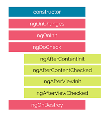

# Angular Interview Questions & Answers

> Click :star:if you like the project. Pull Request are highly appreciated.

### Table of Contents

| No. | Questions |
|---- | ---------
|1 | [What is Angular?](#what-is-angular) |
|2 | [What is the difference between AngularJS and Angular?](#what-is-the-difference-between-angularjs-and-angular?)|
|3 | [What is TypeScript?](#what-is-typescript)|
|4 | [Write a pictorial diagram of Angular architecture?](#write-a-pictorial-diagram-of-angular-architecture)|
|5 | [What are the key components of Angular?](#what-are-the-key-components-of-angular?)|
|6 | [What are directives?](#what-are-directives)|
|7 | [What are components?](#what-are-components)|
|8 | [What are the differences between Component and Directive?](#what-are-the-differences-between-component-and-directive)|
|9 | [What is a template?](#what-is-a-template)|
|10| [What is a module?](#what-is-a-module?)|
|11| [What are lifecycle hooks available?](#what-are-lifecycle-hooks-available)|
|12| [What is a data binding?](#what-is-a-data-binding)|
|13| [What is metadata?](#what-is-metadata)|
|14| [What is Angular CLI?](#what-is-angular-cli)|
|15| [What is the difference between constructor and ngOnInit?](#what-is-the-difference-between-constructor-and-ngoninit?)|
|16| [What is a service](#what-is-a-service)|
|17| [What is dependency injection in Angular?](#what-is-dependency-injection-in-angular)|
|18| [How is Dependency Hierarchy formed?](#how-is-dependency-hierarchy-formed)|
|19| [What is the purpose of async pipe?](#what-is-the-purpose-of-async-pipe)|
|20| [What is the option to choose between inline and external template file?](#what-is-the-option-to-choose-between-inline-and-external-template-file)|
|21| [What is the purpose of *ngFor directive?](#what-is-the-purpose-of-ngfor-directive)|
|22| [What is the purpose of ngIf directive?](#what-is-the-purpose-of-ngif-directive)|
|23| [What happens if you use script tag inside template?](#what-happens-if-you-use-script-tag-inside-template)|
|24| [What is interpolation?](#what-is-interpolation)|
|25| [What are template expressions?](#what-are-template-expressions)|
|26| [What are template statements?](#what-are-template-statements)|
|27| [How do you categorize data binding types?](#how-do-you-categorize-data-binding-types)|
|28| [What are pipes?](#what-are-pipes)|
|29| [What is a parameterized pipe?](#what-is-a-parameterized-pipe)|
|30| [How do you chain pipes?](#how-do-you-chain-pipes)|
|31| [What is a custom pipe?](#what-is-a-custom-pipe)|
|32| [Give an example of custom pipe?](#give-an-example-of-custom-pipe)|
|33| [What is the difference between pure and impure pipe?](#what-is-the-difference-between-pure-and-impure-pipe)|
|34| [What is a bootstrapping module?](#what-is-a-bootstrapping-module)|
|35| [What are observables?](#what-are-observables)|
|36| [What is HttpClient and its benefits?](#what-is-httpclient-and-its-benefits)|
|37| [Explain on how to use HttpClient with an example?](#explain-on-how-to-use-httpclient-with-an-example)|
|38| [How can you read full response?](#how-can-you-read-full-response)|
|39| [How do you perform Error handling?](#how-do-you-perform-error-handling)|
|40| [What is RxJS?](#what-is-rxjs)|
|41| [What is subscribing?](#what-is-subscribing)|
|42| [What is an observable?](#what-is-an-observable)|
|43| [What is an observer?](#what-is-an-observer)|
|44| [What is the difference between promise and observable?](#what-is-the-difference-between-promise-and-observable)|
|45| [What is multicasting?](#what-is-multicasting)|
|46| [How do you perform error handling in observables?](#how-do-you-perform-error-handling-in-observables)|
|47| [What is the short hand notation for subscribe method?](#what-is-the-short-hand-notation-for-subscribe-method)|
|48| [What are the utility functions provided by RxJS?](#what-are-the-utility-functions-provided-by-rxjs)|
|49| [What are observable creation functions?](#what-are-observable-creation-functions)|
|50| [What will happen if you do not supply handler for observer?](#what-will-happen-if-you-do-not-supply-handler-for-observer)|
|51| [What are angular elements?](#what-are-angular-elements)|
|52| [What is the browser support of Angular Elements?](#what-is-the-browser-support-of-angular-elements)|
|53| [What are custom elements?](#what-are-custom-elements)|
|54| [Do I need to bootstrap custom elements?](#do-i-need-to-bootstrap-custom-elements)|
|55| [Explain how custom elements works internally?](#explain-how-custom-elements-works-internally)|
|56| [How to transfer components to custom elements?](#how-to-transfer-components-to-custom-elements)|
|57| [What are the mapping rules between Angular component and custom element?](#what-are-the-mapping-rules-between-angular-component-and-custom-element)|
|58| [How do you define typings for custom elements?](#how-do-you-define-typings-for-custom-elements)|
|59| [What are dynamic components?](#what-are-dynamic-components)|
|60| [What are the various kinds of directives?](#what-are-the-various-kinds-of-directives)|
|61| [How do you create directives using CLI?](#how-do-you-create-directives-using-cli)|
|62| [Give an example for attribute directives?](#give-an-example-for-attribute-directives)|
|63| [What is Angular Router?](#what-is-angular-router)|
|64| [What is the purpose of base href tag?](#what-is-the-purpose-of-base-href-tag)|
|65| [What are the router imports?](#what-are-the-router-imports)|
|66| [What is router outlet?](#what-is-router-outlet)|
|67| [What are router links?](#what-are-router-links)|
|68| [What are active router links?](#what-are-active-router-links)|
|69| [What is router state?](#what-is-router-state)|
|70| [What are router events?](#what-are-router-events)|
|71| [What is activated route?](#what-is-activated-route)|
|72| [How do you define routes?](#how-do-you-define-routes)|
|73| [What is the purpose of Wildcard route?](#what-is-the-purpose-of-wildcard-route)|
|74| [Do I need a Routing Module always?](#do-i-need-a-routing-module-always)|
|75| [What is Angular Universal?](#what-is-angular-universal)|

1. ### What is Angular Framework?

    Angular is a **TypeScript-based open-source** front-end platform that makes it easy to build applications with in web/mobile/desktop. The major features of this framework such as declarative templates, dependency injection, end to end tooling, and many more other features are used to ease the development.

2. ### What is the difference between AngularJS and Angular?
    Angular is a completely revived component-based framework in which an application is a tree of individual components.

    Some of the major difference in tabular form

    | AngularJS | Angular |
    |---- | ---------
    | It is based on MVC architecture  | This is based on Service/Controller |
    | This uses use JavaScript to build the application| Introduced the typescript to write the application |
    | Based on controllers concept| This is a component based UI approach|
    | Not a mobile friendly framework| Developed considering mobile platform|
    | Difficulty in SEO friendly application development| Ease to create SEO friendly applications|

3. ### What is TypeScript?
    TypeScript is a typed superset of JavaScript created by Microsoft that adds optional types, classes, async/await, and many other features, and compiles to plain JavaScript. Angular built entirely in TypeScript and used as a primary language.
    You can install it globally as
    ```
    npm install -g typescript
    ```
    Let's see a simple example of TypeScript usage,
    ```typescript
    function greeter(person: string) {
        return "Hello, " + person;
    }

    let user = "Sudheer";

    document.body.innerHTML = greeter(user);
    ```
    The greeter method allows only string type as argument.

4. ### Write a pictorial diagram of Angular architecture?
    The main building blocks of an Angular application is shown in the below diagram
    

5. ### What are the key components of Angular?
    Angular has the below key components,
    1. **Component:** These are the basic building blocks of angular application to control HTML views.
    2. **Modules:** An angular module is set of angular basic building blocks like component, directives, services etc. An application is divided into logical pieces and each piece of code is called as "module" which perform a single task.
    3. **Templates:** This represent the views of an Angular application.
    4. **Services:** It is used to create components which can be shared across the entire application.
    5. **Metadata:** This can be used to add more data to an Angular class.

6. ### What are directives?
    Directives add behaviour to an existing DOM element or an existing component instance.
    ```typescript
    import { Directive, ElementRef, Input } from '@angular/core';

    @Directive({ selector: '[myHighlight]' })
    export class HighlightDirective {
        constructor(el: ElementRef) {
           el.nativeElement.style.backgroundColor = 'yellow';
        }
    }
    ```

    Now this directive extends HTML element behavior with a yellow background as below
    ```html
    <p myHighlight>Highlight me!</p>
    ```

7. ### What are components?
    Components are the most basic UI building block of an Angular app which formed a tree of Angular components. These components are subset of directives. Unlike directives, components always have a template and only one component can be instantiated per an element in a template.
    Let's see a simple example of Angular component
    ```typescript
    import { Component } from '@angular/core';

    @Component ({
       selector: 'my-app',
       template: ` <div>
          <h1>{{title}}</h1>
          <div>Learn Angular6 with examples</div>
       </div> `,
    })

    export class AppComponent {
       title: string = 'Welcome to Angular world';
    }
    ```

8. ### What are the differences between Component and Directive?
    In a short note, A component(@component) is a directive-with-a-template.

    Some of the major differences are mentioned in a tabular form

    | Component | Directive |
    |---- | ---------
    | To register a component we use @Component meta-data annotation  | To register directives we use @Directive meta-data annotation |
    | Components are typically used to create UI widgets| Directive is used to add behavior to an existing DOM element |
    | Component is used to break up the application into smaller components| Directive is use to design re-usable components|
    | Only one component can be present per DOM element | Many directives can be used per DOM element |
    | @View decorator or templateurl/template are mandatory | Directive doesn't use View|

9. ### What is a template?
    A template is a HTML view where you can display data by binding controls to properties of an Angular component. You can store your component's template in one of two places. You can define it inline using the template property, or you can define the template in a separate HTML file and link to it in the component metadata using the @Component decorator's templateUrl property.
    **Using inline template with template syntax,**
    ```typescript
    import { Component } from '@angular/core';

    @Component ({
       selector: 'my-app',
       template: '
          <div>
             <h1>{{title}}</h1>
             <div>Learn Angular</div>
          </div>
       '
    })

    export class AppComponent {
       title: string = 'Hello World';
    }
    ```
    **Using separate template file such as app.component.html**
    ```typescript
    import { Component } from '@angular/core';

    @Component ({
       selector: 'my-app',
       templateUrl: 'app/app.component.html'
    })

    export class AppComponent {
       title: string = 'Hello World';
    }
    ```

10. ### What is a module?

    Modules are logical boundaries in your application and the application is divided into separate modules to separate the functionality of your application.
    Lets take an example of **app.module.ts** root module declared with **@NgModule** decorator as below,
    ```typescript
    import { NgModule }      from '@angular/core';
    import { BrowserModule } from '@angular/platform-browser';
    import { AppComponent }  from './app.component';

    @NgModule ({
       imports:      [ BrowserModule ],
       declarations: [ AppComponent ],
       bootstrap:    [ AppComponent ]
    })
    export class AppModule { }
    ```
    The NgModule decorator has three options
    1. The imports option is used to import other dependent modules. The BrowserModule is required by default for any web based angular application
    2. The declarations option is used to define components in the respective module
    3. The bootstrap option tells Angular which Component to bootstrap in the application

11. ### What are lifecycle hooks available?
    Angular application goes through an entire set of processes or has a lifecycle right from its initiation to the end of the application.
    The representation of lifecycle in pictorial representation as follows,
    


    The description of each lifecycle method is as below,
    1. **ngOnChanges:** When the value of a data bound property changes, then this method is called.
    2. **ngOnInit:** This is called whenever the initialization of the directive/component after Angular first displays the data-bound properties happens.
    3. **ngDoCheck:** This is for the detection and to act on changes that Angular can't or won't detect on its own.
    4. **ngAfterContentInit:** This is called in response after Angular projects external content into the component's view.
    5. **ngAfterContentChecked:** This is called in response after Angular checks the content projected into the component.
    6. **ngAfterViewInit:** This is called in response after Angular initializes the component's views and child views.
    7. **ngAfterViewChecked:** This is called in response after Angular checks the component's views and child views.
    8. **ngOnDestroy:** This is the cleanup phase just before Angular destroys the directive/component.

12. ### What is a data binding?
    Data binding is a core concept in Angular and allows to define communication between a component and the DOM, making it very easy to define interactive applications without worrying about pushing and pulling data. There are four forms of data binding(divided as 3 categories) which differ in the way the data is flowing.
    1. **From the Component to the DOM:**
    **Interpolation:** {{ value }}: Adds the value of a property from the component
    ```html
    <li>Name: {{ user.name }}</li>
    <li>Address: {{ user.address }}</li>
    ```
    **Property binding:** [property]=”value”: The value is passed from the component to the specified property or simple HTML attribute
    ```html
    <input type="email" [value]="user.email">
    ```
    2. **From the DOM to the Component:**
    **Event binding: (event)=”function”:** When a specific DOM event happens (eg.: click, change, keyup), call the specified method in the component
    ```html
    <button (click)="logout()"></button>
    ```
    3. **Two-way binding:**
    **Two-way data binding:** [(ngModel)]=”value”: Two-way data binding allows to have the data flow both ways. For example, in the below code snippet, both the email DOM input and component email property are in sync
    ```html
    <input type="email" [(ngModel)]="user.email">
    ```

13. ### What is metadata?
    Metadata is used to decorate a class so that it can configure the expected behavior of the class. The metadata is represented by decorators
    1. **Class decorators**, e.g. @Component and @NgModule
    ```typescript
    import { NgModule, Component } from '@angular/core';

    @Component({
      selector: 'my-component',
      template: '<div>Class decorator</div>',
    })
    export class MyComponent {
      constructor() {
        console.log('Hey I am a component!');
      }
    }

    @NgModule({
      imports: [],
      declarations: [],
    })
    export class MyModule {
      constructor() {
        console.log('Hey I am a module!');
      }
    }
    ```
    2. **Property decorators** Used for properties inside classes, e.g. @Input and @Output
    ```typescript
    import { Component, Input } from '@angular/core';

    @Component({
        selector: 'my-component',
        template: '<div>Property decorator</div>'
    })

    export class MyComponent {
        @Input()
        title: string;
    }
    ```
    3. **Method decorators** Used for methods inside classes, e.g. @HostListener
    ```typescript
    import { Component, HostListener } from '@angular/core';

    @Component({
        selector: 'my-component',
        template: '<div>Method decorator</div>'
    })
    export class MyComponent {
        @HostListener('click', ['$event'])
        onHostClick(event: Event) {
            // clicked, `event` available
        }
    }
    ```
    4. **Parameter decorators** Used for parameters inside class constructors, e.g. @Inject
    ```typescript
    import { Component, Inject } from '@angular/core';
    import { MyService } from './my-service';

    @Component({
        selector: 'my-component',
        template: '<div>Parameter decorator</div>'
    })
    export class MyComponent {
        constructor(@Inject(MyService) myService) {
            console.log(myService); // MyService
        }
    }
    ```

14. ### What is angular CLI?
    Angular CLI(**Command Line Interface**) is a command line interface to scaffold and build angular apps using nodejs style (commonJs) modules.
    You need to install using below npm command,
    ```
    npm install @angular/cli@latest
    ```
    Below are the list of few commands, which will come handy while creating angular projects
    1. **Creating New Project:** ng new <project-name>
    2. **Generating Components, Directives & Services:** ng generate/g <feature-name>
    The different types of commands would be,
    * ng generate class my-new-class: add a class to your application
    * ng generate component my-new-component: add a component to your application
    * ng generate directive my-new-directive: add a directive to your application
    * ng generate enum my-new-enum: add an enum to your application
    * ng generate module my-new-module: add a module to your application
    * ng generate pipe my-new-pipe: add a pipe to your application
    * ng generate service my-new-service: add a service to your application
    3. **Running the Project:** ng serve

15. ### What is the difference between constructor and ngOnInit?
    TypeScript classes has a default method called constructor which is normally used for the initialization purpose. Whereas ngOnInit method is specific to Angular, especially used to define Angular bindings. Even though constructor getting called first, it is preferred to move all of your Angular bindings to ngOnInit method.
    In order to use ngOnInit, you need to implement OnInit interface as below,
    ```typescript
    export class App implements OnInit{
      constructor(){
         //called first time before the ngOnInit()
      }

      ngOnInit(){
         //called after the constructor and called  after the first ngOnChanges()
      }
    }
    ```
16. ### What is a service?
    A service is used when a common functionality needs to be provided to various modules. Services allow for greater separation of concerns for your application and better modularity by allowing you to extract common functionality out of components.
    Let's create a repoService which can be used across components,
    ```typescript
    import { Injectable } from '@angular/core';
    import { Http } from '@angular/http';

    @Injectable() // The Injectable decorator is required for dependency injection to work
    export class RepoService{
      constructor(private http: Http){
      }

      fetchAll(){
        return this.http.get('https://api.github.com/repositories').map(res => res.json());
      }
    }
    ```
    The above service uses Http service as a dependency.

17. ### What is dependency injection in Angular?
    Dependency injection (DI), is an important application design pattern in which a class asks for dependencies from external sources rather than creating them itself. Angular comes with its own dependency injection framework for resolving dependencies( services or objects that a class needs to perform its function).So you can have your services depend on other services throughout your application.

18. ### How is Dependency Hierarchy formed?

19. ### What is the purpose of async pipe?
    The AsyncPipe subscribes to an observable or promise and returns the latest value it has emitted. When a new value is emitted, the pipe marks the component to be checked for changes.
    Let's take a time observable which continuously updates the view for every 2 seconds with the current time.
    ```typescript
    @Component({
      selector: 'async-observable-pipe',
      template: `<div><code>observable|async</code>:
           Time: {{ time | async }}</div>`
    })
    export class AsyncObservablePipeComponent {
      time = new Observable(observer =>
        setInterval(() => observer.next(new Date().toString()), 2000)
      );
    }
    ```
20. ### What is the option to choose between inline and external template file?
    You can store your component's template in one of two places. You can define it inline using the **template** property, or you can define the template in a separate HTML file and link to it in the component metadata using the **@Component** decorator's **templateUrl** property.
    The choice between inline and separate HTML is a matter of taste, circumstances, and organization policy. But normally we use inline template for small portion of code and external template file for bigger views. By default, the Angular CLI generates components with a template file. But you can override that with the below command,
    ```
    ng generate component hero -it
    ```
21. ### What is the purpose of ngFor directive?
    We use Angular ngFor directive in the template to display each item in the list. For example, here we iterate over list of users,
    ```html
    <li *ngFor="let user of users">
      {{ user }}
    </li>
    ```
    The user variable in the ngFor double-quoted instruction is a **template input variable**
22. ### What is the purpose of ngIf directive?
    Sometimes an app needs to display a view or a portion of a view only under specific circumstances. The Angular ngIf directive inserts or removes an element based on a truthy/falsy condition. Let's take an example to display a message if the user age is more than 18,
    ```html
    <p *ngIf="user.age > 18">You are not eligible for student pass!</p>
    ```
    **Note:** Angular isn't showing and hiding the message. It is adding and removing the paragraph element from the DOM. That improves performance, especially in the larger projects with many data bindings.

23. ### What happens if you use script tag inside template?

    Angular recognizes the value as unsafe and automatically sanitizes it, which removes the **<script>** tag but keeps safe content such as the text content of the <script> tag. This way it eliminates the risk of script injection attacks. If you still use it then it will be ignored and a warning appears in the browser console.
    Let's take an example of innerHtml property binding which causes XSS vulnerability,
    ```typescript
    export class InnerHtmlBindingComponent {
      // For example, a user/attacker-controlled value from a URL.
      htmlSnippet = 'Template <script>alert("0wned")</script> <b>Syntax</b>';
    }
    ```

24. ### What is interpolation?

    Interpolation is a special syntax that Angular converts into property binding. It’s a convenient alternative to property binding. It is represented by double curly braces({{}}). The text between the braces is often the name of a component property. Angular replaces that name with the string value of the corresponding component property.
    Let's take an example,
    ```html
    <h3>
      {{title}}
      
    </h3>
    ```
    In the example above, Angular evaluates the title and url properties and fills in the blanks, first displaying a bold application title and then a URL.

25. ### What are template expressions?
    A template expression produces a value similar to any Javascript expression. Angular executes the expression and assigns it to a property of a binding target; the target might be an HTML element, a component, or a directive. In the property binding, a template expression appears in quotes to the right of the = symbol as in [property]="expression".
    In interpolation syntax, the template expression is surrounded by double curly braces. For example, in the below interpolation, the template expression is {{username}},
    ```html
    <h3>{{username}}, welcome to Angular</h3>
    ```
    The below javascript expressions are prohibited in template expression
    1. assignments (=, +=, -=, ...)
    2. new
    3. chaining expressions with ; or ,
    4. increment and decrement operators (++ and --)
    ----------------------------------
26. ### What are template statements?
    A template statement responds to an event raised by a binding target such as an element, component, or directive. The template statements appear in quotes to the right of the = symbol like **(event)="statement"**. Let's take an example of button click event's statement
    ```html
    <button (click)="editProfile()">Edit Profile</button>
    ```
    In the above expression, editProfile is a template statement. The below JavaScript syntax expressions are not allowed.
    1. new
    2. increment and decrement operators, ++ and --
    3. operator assignment, such as += and -=
    4. the bitwise operators | and &
    5. the template expression operators
    --------------------------------------
27. ### How do you categorize data binding types?

     Binding types can be grouped into three categories distinguished by the direction of data flow. They are listed as below,
     1. From the source-to-view
     2. From view-to-source
     3. View-to-source-to-view

     The possible binding syntax can be tabularized as below,

      | Data direction | Syntax | Type |
      |---- | --------- | ---- |
      | From the source-to-view(One-way)  | 1. {{expression}} 2. [target]="expression" 3. bind-target="expression" | Interpolation, Property, Attribute, Class, Style|
      | From view-to-source(One-way) | 1. (target)="statement" 2. on-target="statement" | Event |
      | View-to-source-to-view(Two-way)| 1. [(target)]="expression" 2. bindon-target="expression"| Two-way |

28. ### What are pipes?
    A pipe takes in data as input and transforms it to a desired output. For example, let us take a pipe to transform a component's birthday property into a human-friendly date using **date** pipe.
    ```javascript
    import { Component } from '@angular/core';

    @Component({
      selector: 'app-birthday',
      template: `<p>Birthday is {{ birthday | date }}</p>`
    })
    export class BirthdayComponent {
      birthday = new Date(1987, 6, 18); // June 18, 1987
    }
    ```
29. ### What is a parameterized pipe?
    A pipe can accept any number of optional parameters to fine-tune its output. The parameterized pipe can be created by declaring the pipe name with a colon ( : ) and then the parameter value. If the pipe accepts multiple parameters, separate the values with colons. Let's take a birthday example with a particular format(dd/mm/yyyy):
    ```javascript
    import { Component } from '@angular/core';

        @Component({
          selector: 'app-birthday',
          template: `<p>Birthday is {{ birthday | date | 'dd/mm/yyyy'}}</p>` // 18/06/1987
        })
        export class BirthdayComponent {
          birthday = new Date(1987, 6, 18);
        }
    ```
    **Note:** The parameter value can be any valid template expression, such as a string literal or a component property.
30. ### How do you chain pipes?
    You can chain pipes together in potentially useful combinations as per the needs. Let's take a birthday property which uses date pipe(along with parameter) and uppercase pipes as below
    ```javascript
    import { Component } from '@angular/core';

            @Component({
              selector: 'app-birthday',
              template: `<p>Birthday is {{  birthday | date:'fullDate' | uppercase}} </p>` // THURSDAY, JUNE 18, 1987
            })
            export class BirthdayComponent {
              birthday = new Date(1987, 6, 18);
            }

    ```
31. ### What is a custom pipe?
    Apart from built-inn pipes, you can write your own custom pipe with the below key characteristics,
    1. A pipe is a class decorated with pipe metadata **@Pipe** decorator, which you import from the core Angular library
       For example,
    ```javascript
        @Pipe({name: 'myCustomPipe'})
    ```
    2. The pipe class implements the **PipeTransform** interface's transform method that accepts an input value followed by optional parameters and returns the transformed value.
       The structure of pipeTransform would be as below,
    ```javascript
    interface PipeTransform {
      transform(value: any, ...args: any[]): any
    }
    ```
    3. The @Pipe decorator allows you to define the pipe name that you'll use within template expressions. It must be a valid JavaScript identifier.
    ```javascript
    template: `{{someInputValue | myCustomPipe: someOtherValue}}`
    ```
32. ### Give an example of custom pipe?
    You can create custom reusable pipes for the transformation of existing value. For example, let us create a custom pipe for finding file size based on an extension,
    ```javascript
    import { Pipe, PipeTransform } from '@angular/core';

    @Pipe({name: 'customFileSizePipe'})
    export class FileSizePipe implements PipeTransform {
      transform(size: number, extension: string = 'MB'): string {
        return (size / (1024 * 1024)).toFixed(2) + extension;
      }
    }
    ```
    Now you can use the above pipe in template expression as below,
    ```javascript
     template: `
        <h2>Find the size of a file</h2>
        <p>Size: {{288966 | customFileSizePipe: 'GB'}}</p>
      `
    ```
33. ### What is the difference between pure and impure pipe?
    A pure pipe is only called when Angular detects a change in the value or the parameters passed to a pipe. For example, any changes to a primitive input value (String, Number, Boolean, Symbol) or a changed object reference (Date, Array, Function, Object). An impure pipe is called for every change detection cycle no matter whether the value or parameters changes. i.e, An impure pipe is called often, as often as every keystroke or mouse-move.
34. ### What is a bootstrapping module?
    Every application has at least one Angular module, the root module that you bootstrap to launch the application is called as bootstrapping module. It is commonly known as AppModule. The default structure of AppModule generated by AngularCLI would be as follows,
    ```javascript
    /* JavaScript imports */
    import { BrowserModule } from '@angular/platform-browser';
    import { NgModule } from '@angular/core';
    import { FormsModule } from '@angular/forms';
    import { HttpClientModule } from '@angular/common/http';

    import { AppComponent } from './app.component';

    /* the AppModule class with the @NgModule decorator */
    @NgModule({
      declarations: [
        AppComponent
      ],
      imports: [
        BrowserModule,
        FormsModule,
        HttpClientModule
      ],
      providers: [],
      bootstrap: [AppComponent]
    })
    export class AppModule { }
    ```
35. ### What are observables?
    Observables are declarative which provide support for passing messages between publishers and subscribers in your application. They are mainly used for event handling, asynchronous programming, and handling multiple values. In this case, you define a function for publishing values, but it is not executed until a consumer subscribes to it. The subscribed consumer then receives notifications until the function completes, or until they unsubscribe.
36. ### What is HttpClient and its benefits?
    Most of the Front-end applications communicate with backend services over HTTP protocol using either XMLHttpRequest interface or the fetch() API. Angular provides a simplified client HTTP API known as **HttpClient** which is based on top of XMLHttpRequest interface. This client is avaialble from `@angular/common/http` package.
    You can import in your root module as below,
    ```javascript
    import { HttpClientModule } from '@angular/common/http';
    ```

    The major advantages of HttpClient can be listed as below,
    1. Contains testability features
    2. Provides typed request and response objects
    3. Intercept request and response
    4. Supports Observalbe APIs
    5. Supports streamlined error handling

37. ### Explain on how to use HttpClient with an example?
    Below are the steps need to be followed for the usage of HttpClient.
    1. Import HttpClient into root module:
    ```javascript
    import { HttpClientModule } from '@angular/common/http';
    @NgModule({
      imports: [
        BrowserModule,
        // import HttpClientModule after BrowserModule.
        HttpClientModule,
      ],
      ......
      })
     export class AppModule {}
    ```
    2. Inject the HttpClient into the application:
    Let's create a userProfileService(userprofile.service.ts) as an example. It also defines get method of HttpClient
    ```javascript
    import { Injectable } from '@angular/core';
    import { HttpClient } from '@angular/common/http';

    const userProfileUrl: string = 'assets/data/profile.json';

    @Injectable()
    export class UserProfileService {
      constructor(private http: HttpClient) { }
    }

    getUserProfile() {
      return this.http.get(this.userProfileUrl);
    }
    ```
    3. Create a component for subscribing service:
    Let's create a component called UserProfileComponent(userprofile.component.ts) which inject UserProfileService and invokes the service method,
    ```javascript
    fetchUserProfile() {
      this.userProfileService.getUserProfile()
        .subscribe((data: User) => this.user = {
            id: data['userId'],
            name: data['firstName'],
            city:  data['city']
        });
    }
    ```
    Since the above service method returns an Observable which needs to be subscribed in the component.
38. ### How can you read full response?
    The response body doesn't may not return full response data because sometimes servers also return special headers or status code which which are important for the application workflow. Inorder to get full response, you should use observe option from HttpClient,
    ```javascript
    getUserResponse(): Observable<HttpResponse<User>> {
      return this.http.get<User>(
        this.userUrl, { observe: 'response' });
    }
    ```
    Now HttpClient.get() method returns an Observable of typed HttpResponse rather than just the JSON data.
39. ### How do you perform Error handling?
    If the request fails on the server or failed to reach the server due to network issues then HttpClient will return an error object instead of a successful reponse. In this case, you need to handle in the component by passing error object as a second callback to subscribe() method.
    Let's see how it can be handled in the component with an example,
    ```javascript
    fetchUser() {
      this.userService.getProfile()
        .subscribe(
          (data: User) => this.userProfile = { ...data }, // success path
          error => this.error = error // error path
        );
    }
    ```
    It is always a good idea to give the user some meaningful feedback instead of displaying the raw error object returned from HttpClient.
40. ### What is RxJS?
    RxJS is a library for composing asynchronous and callback-based code in a functional, reactive style using Observables. Many APIs such as  HttpClient produce and consume RxJS Observables and also uses operators for processing observables.
    For example, you can import observables and operators for using HttpClient as below,
    ```javascript
    import { Observable, throwError } from 'rxjs';
    import { catchError, retry } from 'rxjs/operators';
    ```
41. ### What is subscribing?
    An Observable instance begins publishing values only when someone subscribes to it. So you need to subscribe by calling the **subscribe()** method of the instance, passing an observer object to receive the notifications.
    Let's take an example of creating and subscribing to a simple observable, with an observer that logs the received message to the console.
    ```javascript
    Creates an observable sequence of 5 integers, starting from 1
    const source = range(1, 5);

    // Create observer object
    const myObserver = {
      next: x => console.log('Observer got a next value: ' + x),
      error: err => console.error('Observer got an error: ' + err),
      complete: () => console.log('Observer got a complete notification'),
    };

    // Execute with the observer object and Prints out each item
    myObservable.subscribe(myObserver);
    // => Observer got a next value: 1
    // => Observer got a next value: 2
    // => Observer got a next value: 3
    // => Observer got a next value: 4
    // => Observer got a next value: 5
    // => Observer got a complete notification
    ```
42. ### What is an observable?
    An Observable is a unique Object similar to a Promise that can help manage async code. Observables are not part of the JavaScript language so we need to rely on a popular Observable library called RxJS.
    The observables are created using new keyword. Let see the simple example of observable,
    ```javascript
    import { Observable } from 'rxjs';

    const observable = new Observable(observer => {
      setTimeout(() => {
        observer.next('Hello from a Observable!');
      }, 2000);
    });
    ```

43. ### What is an observer?
    Observer is an interface for a consumer of push-based notifications delivered by an Observable. It has below structure,
    ```javascript
    interface Observer<T> {
      closed?: boolean;
      next: (value: T) => void;
      error: (err: any) => void;
      complete: () => void;
    }
    ```
    A handler that implements the Observer interface for receiving observable notifications will be passed as a parameter for observable as below,
    ```javascript
    myObservable.subscribe(myObserver);
    ```
    **Note:** If you don't supply a handler for a notification type, the observer ignores notifications of that type.
44. ### What is the difference between promise and observable?
    Below are the list of differences between promise and observable,

   | Observable | Promise |
   |---- | --------- |
   | Declarative: Computation does not start until subscription so that they can be run whenever you need the result | Execute immediately on creation|
   | Provide multiple values over time | Provide only one |
   | Subscribe method is used for error handling which makes centralized and predictable error handling| Push errors to the child promises |
   | Provides chaining and subscription to handle complex applications | Uses only .then() clause |

45. ### What is multicasting?
    Multi-casting is the practice of broadcasting to a list of multiple subscribers in a single execution. Let's demonstrate the multi-casting feature,
    ```javascript
    var source = Rx.Observable.from([1, 2, 3]);
    var subject = new Rx.Subject();
    var multicasted = source.multicast(subject);

    // These are, under the hood, `subject.subscribe({...})`:
    multicasted.subscribe({
      next: (v) => console.log('observerA: ' + v)
    });
    multicasted.subscribe({
      next: (v) => console.log('observerB: ' + v)
    });

    // This is, under the hood, `s
    ```
46. ### How do you perform error handling in observables?
    You can handle errors by specifying an **error callback** on the observer instead of relying on try/catch which are ineffective in asynchronous environment. For example, you can define error callback as below,
    ```javascript
    myObservable.subscribe({
      next(num) { console.log('Next num: ' + num)},
      error(err) { console.log('Received an errror: ' + err)}
    });
    ```
47. ### What is the short hand notation for subscribe method?
    The subscribe() method can accept callback function definitions in line, for next, error, and complete handlers is known as short hand notation or Subscribe method with positional arguments. For example, you can define subscribe method as below,
    ```javascript
    myObservable.subscribe(
      x => console.log('Observer got a next value: ' + x),
      err => console.error('Observer got an error: ' + err),
      () => console.log('Observer got a complete notification')
    );
    ```
48. ### What are the utility functions provided by RxJS?
    The RxJS library also provides below utility functions for creating and working with observables.
    1. Converting existing code for async operations into observables
    2. Iterating through the values in a stream
    3. Mapping values to different types
    4. Filtering streams
    5. Composing multiple streams
49. ### What are observable creation functions?
    RxJS provides creation functions for the process of creating observables from things such as promises, events, timers and Ajax requests. Let us explain each of them with an example,
    1. Create an observable from a promise
    ```javascript
    import { from } from 'rxjs'; // from function
    const data = from(fetch('/api/endpoint')); //Created from Promise
    data.subscribe({
     next(response) { console.log(response); },
     error(err) { console.error('Error: ' + err); },
     complete() { console.log('Completed'); }
    });
    ```
    2. Create an observable that creates an AJAX request
    ```javascript
    import { ajax } from 'rxjs/ajax'; // ajax function
    const apiData = ajax('/api/data'); // Created from AJAX request
    // Subscribe to create the request
    apiData.subscribe(res => console.log(res.status, res.response));
    ```
    3. Create an observable from a counter
    ```javascript
    import { interval } from 'rxjs'; // interval function
    const secondsCounter = interval(1000); // Created from Counter value
    secondsCounter.subscribe(n =>
      console.log(`Counter value: ${n}`));
    ```
    4. Create an observable from an event
    ```javascript
    import { fromEvent } from 'rxjs';
    const el = document.getElementById('custom-element');
    const mouseMoves = fromEvent(el, 'mousemove');
    const subscription = mouseMoves.subscribe((e: MouseEvent) => {
      console.log(`Coordnitaes of mouse pointer: ${e.clientX} * ${e.clientY}`);
      });
    ```
50. ### What will happen if you do not supply handler for observer?
    Normally an observer object can define any combination of next, error and complete notification type handlers. If you don't supply a handler for a notification type, the observer just ignores notifications of that type.
51. ### What are angular elements?
    Angular elements are Angular components packaged as **custom elements**(a web standard for defining new HTML elements in a framework-agnostic way). Angular Elements hosts an Angular component, providing a bridge between the data and logic defined in the component and standard DOM APIs, thus, providing a way to use Angular components in `non-Angular environments`.
52. ### What is the browser support of Angular Elements?
    Since Angular elements are packaged as custom elements the browser support of angular elements is same as custom elements support. This feature is is currently supported natively in a number of browsers and pending for other browsers.

    | Browser | Angular Element Support |
    |---- | --------- |
    | Chrome | Natively supported|
    | Opera | Natively supported |
    | Safari| Natively supported |
    | Firefox | Natively supported from 63 version onwards. You need to enable dom.webcomponents.enabled and dom.webcomponents.customelements.enabled in older browsers |
    | Edge| Currently it is in progress|
53. ### What are custom elements?
    Custom elements (or Web Components) are a Web Platform feature which extends HTML by allowing you to define a tag whose content is created and controlled by JavaScript code. The browser maintains a `CustomElementRegistry` of defined custom elements, which maps an instantiable JavaScript class to an HTML tag. Currently this feature is supported by Chrome, Firefox, Opera, and Safari, and available in other browsers through polyfills.
54. ### Do I need to bootstrap custom elements?
    No, custom elements bootstrap (or start) automatically when they are added to the DOM, and are automatically destroyed when removed from the DOM. Once a custom element is added to the DOM for any page, it looks and behaves like any other HTML element, and does not require any special knowledge of Angular.
55. ### Explain how custom elements works internally?
    Below are the steps in an order about custom elements functionality,
    1. **App registers custom element with browser:** Use the createCustomElement() function to convert a component into a class that can be registered with the browser as a custom element.
    2. **App adds custom element to DOM:**  Add custom element just like a built-in HTML element directly into the DOM.
    3. **Browser instantiate component based class:** Browser creates an instance of the registered class and adds it to the DOM.
    4. **Instance provides content with data binding and change detection:** The content with in template is rendered using the component and DOM data.
    The flow chart of the custom elements functionality would be as follows,
    
56. ### How to transfer components to custom elements?
    Transforming components to custom elements involves **two** major steps,
    1. **Build custom element class:** Angular provides the `createCustomElement()` function for converting an Angular component (along with its dependencies) to a custom element. The conversion process implements `NgElementConstructor` interface, and creates a constructor class which is used to produce a self-bootstrapping instance of Angular component.
    2. **Register element class with browser:** It uses `customElements.define()` JS function, to register the configured constructor and its associated custom-element tag with the browser's `CustomElementRegistry`. When the browser encounters the tag for the registered element, it uses the constructor to create a custom-element instance.
    The detailed structure would be as follows,
    
57. ### What are the mapping rules between Angular component and custom element?
    The Component properties and logic maps directly into HTML attributes and the browser's event system. Let us describe them in two steps,
    1. The createCustomElement() API parses the component input properties with corresponding attributes for the custom element. For example, component @Input('myInputProp') converted as custom element attribute `my-input-prop`.
    2. The Component outputs are dispatched as HTML Custom Events, with the name of the custom event matching the output name. For example, component @Output() valueChanged = new EventEmitter() converted as custom element with dispatch event as "valueChanged".
58. ### How do you define typings for custom elements?
    You can use the `NgElement` and `WithProperties` types exported from @angular/elements. Let's see how it can be applied by comparing with Angular component,
    The simple container with input property would be as below,
    ```javascript
    @Component(...)
    class MyContainer {
      @Input() message: string;
    }
    ```
    After applying types typescript validates input value and their types,
    ```javascirpt
    const container = document.createElement('my-container') as NgElement & WithProperties<{message: string}>;
    container.message = 'Welcome to Angular elements!';
    container.message = true;  // <-- ERROR: TypeScript knows this should be a string.
    container.greet = 'News';  // <-- ERROR: TypeScript knows there is no `greet` property on `container`.
    ```
59. ### What are dynamic components?
    Dynamic components are the components in which components location in the application is not defined at build time.i.e, They are not used in any angular template. But the component is instantiated and placed in the application at runtime.
60. ### What are the various kinds of directives?
    There are mainly three kinds of directives.
    1. **Components** — These are directives with a template.
    2. **Structural directives** — These directives change the DOM layout by adding and removing DOM elements.
    3. **Attribute directives** — These directives change the appearance or behavior of an element, component, or another directive.
61. ### How do you create directives using CLI?
    You can use CLI command `ng generate directive` to create the directive class file. It creates the source file(src/app/components/directivename.directive.ts), the respective test file(.spec.ts) and declare the directive class file in root module.
62. ### Give an example for attribute directives?
    Let's take simple highlighter behavior as a example directive for DOM element. You can create and apply the attribute directive using below steps,
    1. Create HighlightDirective class with the file name `src/app/highlight.directive.ts`. In this file, we need to import **Directive** from core library to apply the metadata and **ElementRef** in the directive's constructor to inject a reference to the host DOM element ,
    ```javascript
    import { Directive, ElementRef } from '@angular/core';

    @Directive({
      selector: '[appHighlight]'
    })
    export class HighlightDirective {
        constructor(el: ElementRef) {
           el.nativeElement.style.backgroundColor = 'red';
        }
    }
    ```
    2. Apply the attribute directive as an attribute to the host element(for example, <p>)
    ```javascript
    <p appHighlight>Highlight me!</p>
    ```
    3. Run the application to see the highlight behavior on paragraph element
    ```javascript
    ng serve
    ```
63. ### What is Angular Router?
    Angular Router is a mechanism in which navigation happens from one view to the next as users perform application tasks. It borrows the concepts or model of browser's application navigation.
64. ### What is the purpose of base href tag?
    The routing application should add <base> element to the index.html as the first child in the <head> tag inorder to indicate how to compose navigation URLs. If app folder is the application root then you can set the href value as below
    ```html
    <base href="/">
    ```
65. ### What are the router imports?
    The Angular Router which represents a particular component view for a given URL is not part of Angular Core. It is available in library named `@angular/router` to import required router components. For example, we import them in app module as below,
    ```javascript
    import { RouterModule, Routes } from '@angular/router';
    ```
66. ### What is router outlet?
    The RouterOutlet is a directive from the router library and it  acts as a placeholder that marks the spot in the template where the router should display the components for that outlet. Router outlet is used like a component,
    ```html
    <router-outlet></router-outlet>
    <!-- Routed components go here -->
    ```
67. ### What are router links?
    The RouterLink is a directive on the anchor tags give the router control over those elements. Since the navigation paths are fixed, you can assign string values to router-link directive as below,
    ```html
    <h1>Angular Router</h1>
    <nav>
      <a routerLink="/todosList" >List of todos</a>
      <a routerLink="/completed" >Completed todos</a>
    </nav>
    <router-outlet></router-outlet>
    ```
68. ### What are active router links?
    RouterLinkActive is a directive that toggles css classes for active RouterLink bindings based on the current RouterState. i.e, the Router will add CSS classes when this link is active and and remove when the link is inactive. For example, you can add them to RouterLinks as below
     ```html
    <h1>Angular Router</h1>
    <nav>
      <a routerLink="/todosList" routerLinkActive="active">List of todos</a>
      <a routerLink="/completed" routerLinkActive="active">Completed todos</a>
    </nav>
    <router-outlet></router-outlet>
    ```
69. ### What is router state?
    RouterState is a tree of activated routes. Every node in this tree knows about the "consumed" URL segments, the extracted parameters, and the resolved data. You can access the current RouterState from anywhere in the application using the `Router service` and the `routerState` property.
    ```javascript
    @Component({templateUrl:'template.html'})
    class MyComponent {
      constructor(router: Router) {
        const state: RouterState = router.routerState;
        const root: ActivatedRoute = state.root;
        const child = root.firstChild;
        const id: Observable<string> = child.params.map(p => p.id);
        //...
      }
    }
    ```
70. ### What are router events?
    During each navigation, the Router emits navigation events through the Router.events property allowing you to track the lifecycle of the route. The sequence of router events is as below,
    1. NavigationStart,
    2. RouteConfigLoadStart,
    3. RouteConfigLoadEnd,
    4. RoutesRecognized,
    5. GuardsCheckStart,
    6. ChildActivationStart,
    7. ActivationStart,
    8. GuardsCheckEnd,
    9. ResolveStart,
    10. ResolveEnd,
    11. ActivationEnd
    12. ChildActivationEnd
    13. NavigationEnd,
    14. NavigationCancel,
    15. NavigationError
    16. Scroll
71. ### What is activated route?
    ActivatedRoute contains the information about a route associated with a component loaded in an outlet. It can also be used to traverse the router state tree. The ActivatedRoute will be injected as a router service to access the information. In the below example, you can access route path and parameters,
    ```javascript
    @Component({...})
    class MyComponent {
      constructor(route: ActivatedRoute) {
        const id: Observable<string> = route.params.pipe(map(p => p.id));
        const url: Observable<string> = route.url.pipe(map(segments => segments.join('')));
        // route.data includes both `data` and `resolve`
        const user = route.data.pipe(map(d => d.user));
      }
    }
    ```
72. ### How do you define routes?
     A router must be configured with a list of route definitions. You configures the router with routes via the `RouterModule.forRoot()` method, and adds the result to the AppModule's `imports` array.
     ```javascript
    const appRoutes: Routes = [
      { path: 'todo/:id',      component: TodoDetailComponent },
      {
        path: 'todos',
        component: TodosListComponent,
        data: { title: 'Todos List' }
      },
      { path: '',
        redirectTo: '/todos',
        pathMatch: 'full'
      },
      { path: '**', component: PageNotFoundComponent }
    ];

    @NgModule({
      imports: [
        RouterModule.forRoot(
          appRoutes,
          { enableTracing: true } // <-- debugging purposes only
        )
        // other imports here
      ],
      ...
    })
    export class AppModule { }
     ```
73. ### What is the purpose of Wildcard route?
    If the URL doesn't match any predefined routes then it causes the router to throw an error and crash the app. In this case, you can use wildcard route. A wildcard route has a path consisting of two asterisks to match every URL.
    For example, you can define PageNotFoundComponent for wildcard route as below
    ```javascript
    { path: '**', component: PageNotFoundComponent }
    ```
74. ### Do I need a Routing Module always?
    No, the Routing Module is a design choice. You can skip routing Module (for example, AppRoutingModule) when the configuration is simple and merge the routing configuration directly into the companion module (for example, AppModule). But it is recommended when the configuration is complex and includes specialized guard and resolver services.
75. ### What is Angular Universal?
    Angular Universal is a server-side rendering module for Angular applications in various scenarios. This is a community driven project and available under @angular/platform-server package. Recently Angular Universal is integrated with Angular CLI.